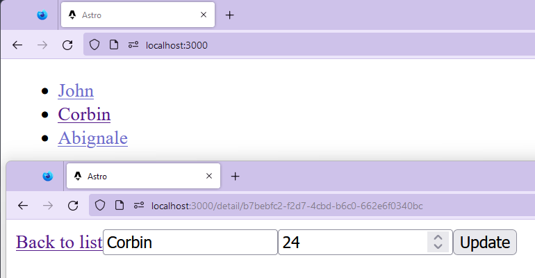
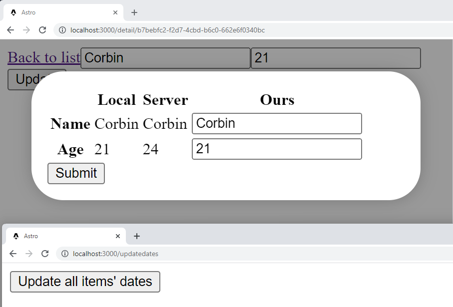

# Offline-First React App

> This repo is meant to act as a proof-of-concept. As a result, it may have bugs, incomplete features, styling issues, and other problems.

This is a proof-of-concept for an offline-first React app that interacts with a server.



It features:

- A React app that only needs to fetch data once a day
- Eager loading of data when the app is online
- A server that uses a simple JSON file as a database
- A list view of people that are in  the "database"
- A detail view of a person that doesn't require a network request
- A "diff" view that encourages the user to select the new data when the server updates while the app is offline



# Getting Started

To get started, run the following commands:

```bash
yarn install
yarn dev
```

This will start the server and the client. The client will be available at http://localhost:3000.

## How to Use It

The app is designed to be used in the following way:

1. Open the app in a browser
2. Disable the network connection
3. Open a person's detail view
4. Change the person's name
5. Enable the network connection
6. Watch the data be updated to the server


To see the diff view, follow these steps:

1. Open the app in a browser
2. Disable the network connection
3. Open a person's detail view
4. Change the person's name
5. Open [`localhost:3000/updatedates`](http://localhost:3000/updatedates) in a new tab
6. Press the "Update" button
7. Enable the network connection on the first tab


# Technologies Used

This app uses the following technologies:

- [Astro](https://astro.build/) to easily consolidate the client and server into a single 
- [React](https://reactjs.org/) to build the UI
- [React Query](https://react-query.tanstack.com/) to handle data fetching
- [HouseForm](https://houseform.dev) to build forms
- [React Router](https://reactrouter.com/) to handle routing
